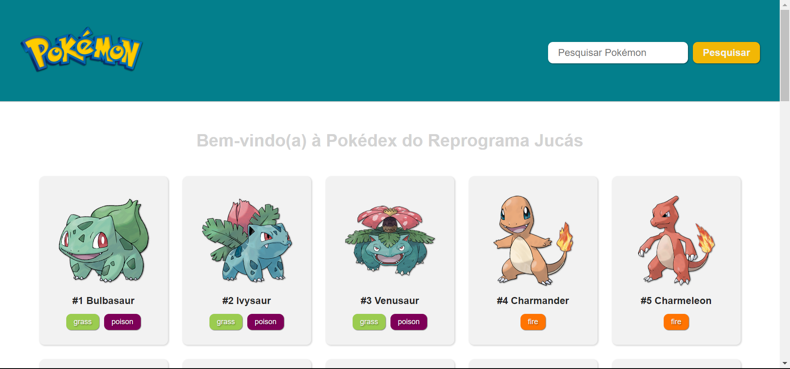

# Pokédex

Desenvolvido como parte do módulo de React no curso de [Desenvolvimento Web](https://emanuelquintino.github.io/Page-WDC/),
este projeto tem como objetivo criar uma Pokédex interativa que permite visualizar todos os Pokémon, fornecer detalhes sobre cada um deles, implementar paginação e incluir um campo de busca para encontrar Pokémon específico.



## Funcionalidades

- Integração com PokeAPI
- Listagem e paginação com todos os Pokémon
- Página com informações detalhadas ao clicar no Pokémon
- Campo de busca ao digitar nome
- Deploy da Aplicação

## Tecnologias Utilizadas

- `React`
- `TypeScript`
- `Styled Components`
- `React Router DOM`
- `React Hook Form`
- `React Tanstack Query`

## Configuração do Projeto

```bash
# Clone o repositório
$ git clone https://github.com/OdilonEnrique/Pokedex.git

# Instale as dependências
$ npm install

# Execute o projeto
$ npm run dev
```

## Variável Ambiente

```ini
VITE_API="https://pokeapi.co/api/v2"
```

## Contribuição

Para contribuir com melhorias, correções de bugs ou novas funcionalidades, basta seguir estas etapas:

1. Faça um fork do projeto
2. Crie uma branch para sua contribuição:

```bash
$ git checkout -b nome-sobrenome
```

3. Faça as alterações desejadas
4. Envie um pull request

## Links

- [Deploy](https://pokedex-one-ruby.vercel.app/)
- [PokeAPI](https://pokeapi.co/)
